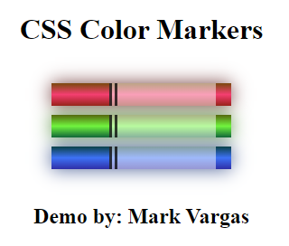
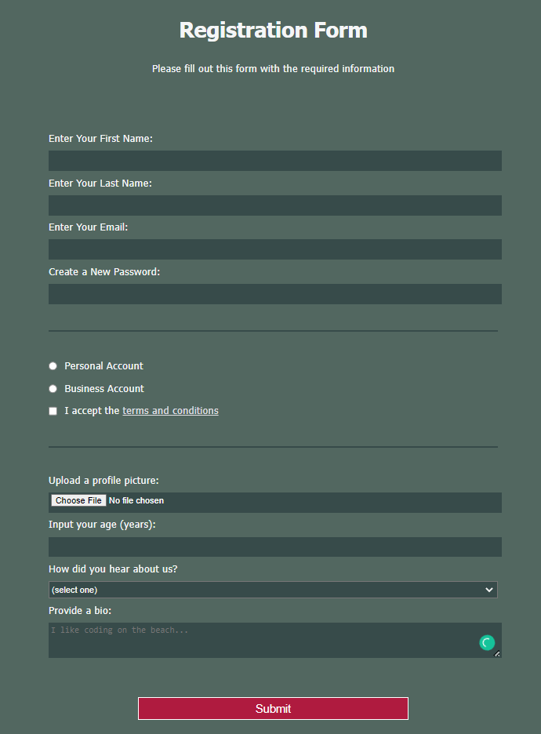

# Project Title

Responsive Web Design

## Getting Started

This will be my freecodecamp responsive_web_design repository to store my code and log my progress.

## Author

- **Mark "Tag" Vargas**

## Acknowledgments

- FreeCodeCamp
- DavidGray
- CoderCoder

### Goal

Get certification for responsive web design

### Deadline

- HTML = February 21,
- CSS = March 4

### Milestones

1. Camper menu
   
2. CSS Color marker
   
3. Registration Form
   
4. Survey Form
   
5. Rothko Paint
   
6. Photo Gallery
   
7. Nutrition Label
   
8. Accessibility
   
9. Tribute Page
   
10. Balance Sheet
    
11. Picasso Painting
    
12. Piano
    
13. Technical Documentation
    
